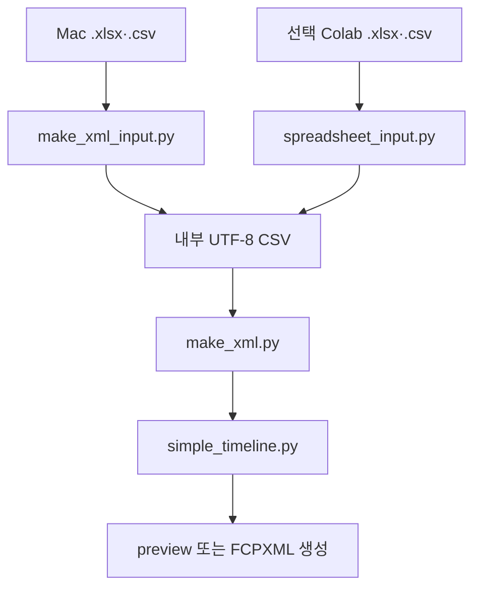

# 코드 구조

이 문서는 저장소를 처음 살펴보는 개발자를 위한 짧은 지도입니다. 수정 절차, 테스트, 소스 SHA-256과 패키징은 [개발 가이드](DEVELOPMENT.md)에 있습니다.

## 실행 흐름

정밀 CSV가 들어오면 `simple_timeline.py` 변환을 건너뜁니다. `project.json` 고급 모드는 core engine을 직접 실행할 수 있습니다.

## 책임 경계

| 파일 | 한 문장 책임 |
|---|---|
| `notebooks/CSV_to_FCPXML_Colab.ipynb` | 일반 사용자 설정, 직접 업로드, 사전 검사와 안전한 결과 다운로드 |
| `spreadsheet_input.py` | CSV·XLSX 기획표를 검사하고 동일한 내부 UTF-8 CSV로 정규화 |
| `make_xml_input.py` | Mac 프로젝트의 Excel·CSV 선택과 임시 CSV 변환·정리 |
| `make_xml.py` | beginner/precision 판별, 방향 선택과 preview/build를 조정하는 간편 진입점 |
| `simple_timeline.py` | 기본 6열과 선택 5열을 방향별 정밀 타임라인으로 바꾸는 어댑터 |
| `preview_report.py` | 대표 프레임, 예상 크롭·여백과 자막 안전영역 HTML 생성 |
| `csv_to_fcpxml.py` | 미디어·시간을 검사하고 FCPXML, Title·Caption·SRT를 만드는 core engine |
| `scripts/validate_fcpxml.py` | 생성 XML 구조와 상대 미디어 경로를 독립 검사 |
| `open_in_final_cut.py` | Mac에서 XML 열기를 Final Cut Pro에 전달 |
| `create_project.py` | 로컬 고급 사용자의 프로젝트 뼈대 생성 |

## 입력에서 결과까지

1. Mac은 `make_xml_input.py`, Colab은 `spreadsheet_input.py`로 XLSX/CSV를 같은 내부 UTF-8 CSV로 정규화합니다.
2. 노트북 또는 `make_xml.py`가 프로젝트 내부 경로와 방향 선택을 확인합니다.
3. 초보자 기획표이면 `simple_timeline.py`가 사진·영상을 판별하고 장면 길이를 정수 프로젝트 프레임으로 누적합니다.
4. 인라인 `화면 자막`이 있으면 같은 장면 길이의 내부 자막 행을 만듭니다.
5. `csv_to_fcpxml.py`가 실제 미디어 길이·오디오·겹침을 검사합니다.
6. `--preview-only`는 `Generated/preview/index.html`과 대표 썸네일을 만듭니다.
7. 실제 빌드는 사진을 방향별 `.build_media` 호환 캐시로 변환합니다.
8. 방향별 clean XML과 선택한 Title·Caption XML, SRT와 report를 원자적으로 씁니다.
9. validator가 해상도·FPS, XML resource와 상대 미디어 URI를 검사합니다.
10. Colab은 허용된 결과만 manifest와 ZIP에 담습니다.

## 초보자 기획표 경계

기본 열:

~~~text
파일,영상 원본 시작,영상 원본 끝,사진 표시 시간(초),화면 자막,소리
~~~

선택 열:

~~~text
순서,화면 맞춤,세로 화면 맞춤,가로 화면 맞춤,메모
~~~

열 의미와 친화 라벨은 `simple_timeline.py`가 소유합니다. `.xlsx`와 `.csv`는 같은 열 계약을 사용하며, Colab은 둘을 내부 CSV로 통일합니다. 템플릿과 문서는 독자적인 기본값을 만들지 않습니다.

## 결과 경로 계약

~~~text
MyVideo/
├─ timeline.xlsx                    # 또는 timeline.csv
├─ Media/
│  ├─ clip.mov
│  └─ photo.png
└─ Generated/
   ├─ preview/index.html
   ├─ vertical_9x16/
   │  ├─ MyVideo_vertical_9x16_clean.fcpxml
   │  ├─ MyVideo_vertical_9x16_with_titles.fcpxml
   │  └─ .build_media/
   └─ horizontal_16x9/
      ├─ MyVideo_horizontal_16x9_clean.fcpxml
      ├─ MyVideo_horizontal_16x9_with_titles.fcpxml
      └─ .build_media/
~~~

위는 `--layout both`의 새 출력 계약입니다. FCPXML은 각 방향 폴더를 기준으로 `../../Media/...`와 같은 방향의 `.build_media/...`를 참조합니다. 기존 별칭과 고급 `project.json` 출력은 호환을 위해 평면 구조를 유지할 수 있습니다. Colab `/content`, Windows drive 또는 Mac 사용자 절대경로를 결과에 넣지 않습니다.

## 더 보기

- 일반 사용법: [사용자 가이드](USER_GUIDE.md)
- 고급 CSV와 `project.json`: [입력 파일 작성법](INPUT_FORMAT.md)
- 기능 수정·테스트·패키지: [개발 가이드](DEVELOPMENT.md)
- GitHub 공개와 릴리스: [배포자 가이드](PUBLISHING.md)
