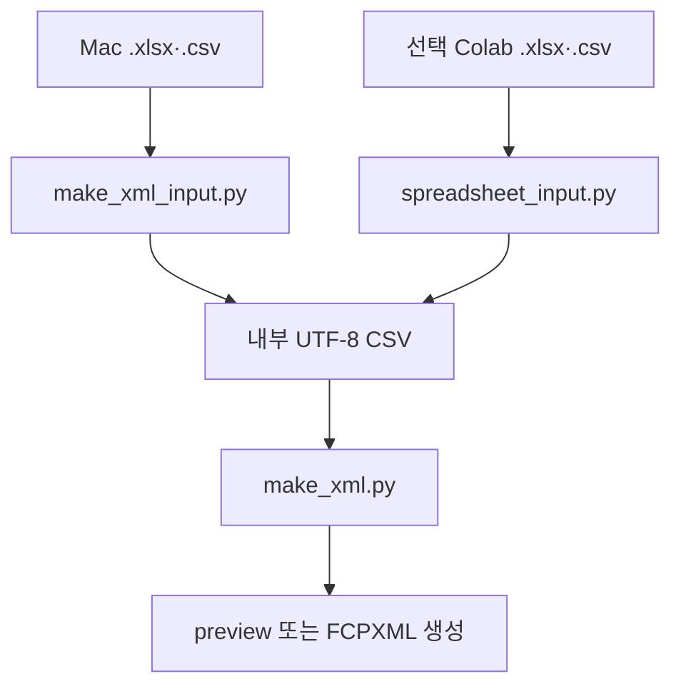

# 개발 가이드

이 문서는 기능을 수정하고 테스트·패키징하는 개발자를 위한 문서입니다. 일반 실행 방법은 [사용자 가이드](USER_GUIDE.md), GitHub 주소와 릴리스 설정은 [배포자 가이드](PUBLISHING.md)를 봅니다.

## 실행 구조

- Mac 간편 CLI는 `make_xml_input.py`, Colab은 `spreadsheet_input.py`를 통해 `.xlsx`와 `.csv`를 같은 내부 UTF-8 CSV로 정규화합니다.
- 초보자 기획표는 `simple_timeline.py`에서 순서 누적형 정밀 CSV로 변환됩니다.
- 정밀 CSV는 어댑터를 건너뛰고 core engine으로 전달됩니다.
- `project.json` 고급 모드는 `csv_to_fcpxml.py`를 직접 실행할 수 있습니다.
- Colab 결과 패키징과 다운로드 정책은 노트북이 소유합니다.

## 파일별 책임

| 파일 | 책임 | 넣지 않는 것 |
|---|---|---|
| `notebooks/CSV_to_FCPXML_Colab.ipynb` | 사용자 폼, 직접 업로드, 세션, 입력 전검사, 결과 allowlist와 ZIP | FCPXML 생성 규칙 |
| `spreadsheet_input.py` | CSV·XLSX 정규화, OOXML 안전 검사, 시트·셀 값 선택 | 미디어 검사와 FCPXML 생성 |
| `make_xml_input.py` | Mac 입력 선택, XLSX 임시 변환과 정리 | 타임라인 계산과 XML emitter |
| `make_xml.py` | 간편 CLI, 입력 모드·방향 판별, preview/build 조정 | CSV 열별 계산과 XML emitter |
| `simple_timeline.py` | 초보자 열, 친화 라벨, 미디어 자동 판별, 프레임 누적, 내부 정밀 CSV | Colab UI와 FCPXML XML 구조 |
| `preview_report.py` | 썸네일, 크롭·여백 계산과 자막 안전영역 HTML | FCPXML 생성과 피사체 인식 |
| `csv_to_fcpxml.py` | 시간·미디어 검증, 사진 캐시, FCPXML, Title·Caption·SRT, BGM | 업로드 UI와 결과 ZIP 정책 |
| `scripts/validate_fcpxml.py` | XML 구조, resource, 상대 미디어 URI 검사 | Final Cut 렌더링 보장 |
| `open_in_final_cut.py` | macOS에 생성 XML 열기 요청 | Library/Event 자동 승인 |
| `create_project.py` | 로컬 프로젝트 뼈대 생성 | Colab 직접 업로드 |

더 짧은 코드 지도는 [아키텍처](ARCHITECTURE.md)에 있습니다.

## 초보자 기획표 계약

기본 배포 양식은 다음 여섯 열입니다.

~~~text
파일,영상 원본 시작,영상 원본 끝,사진 표시 시간(초),화면 자막,소리
~~~

확장 선택 열:

~~~text
순서,화면 맞춤,세로 화면 맞춤,가로 화면 맞춤,메모
~~~

core adapter는 `파일`을 필수로 하고 나머지 알려진 열은 선택적으로 읽습니다. 공개 Colab의 전검사는 기본 6열과 위 선택 열만 허용해야 하며, 오타를 조용히 무시하면 안 됩니다.

열 의미의 단일 소유자는 `simple_timeline.py`입니다.

- `BEGINNER_HEADERS`: 허용 열
- `AUDIO_LABELS`: `사용`·`끄기`와 호환 별칭
- `CONFORM_LABELS`: 사용자 문구를 `fit`·`fill`·`none`으로 변환
- `_read_beginner_rows()`: 헤더, 파일명과 행 입력 검사
- `build_simple_timeline()`: 사진·영상 규칙, 정수 프레임 누적과 내부 CSV 생성

노트북, 템플릿과 문서는 이 계약을 표시하는 소비자입니다. 서로 다른 규칙을 새로 구현하지 않습니다.

## 코드 주석 원칙

사용자가 요청한 “어떤 코드에 무엇이 들어가는지”가 유지되도록 다음을 지킵니다.

1. public 함수에는 입력, 출력, 오류와 단위를 docstring으로 적습니다.
2. 분기 위에는 코드가 무엇을 하는지보다 **왜 자동 추측하지 않는지**를 설명합니다.
3. 사용자 문구의 별칭은 상수 표 한곳에 둡니다.
4. 사진과 영상에 다른 검사를 적용하는 이유를 가까운 주석에 남깁니다.
5. FCPXML의 시간은 초·프레임·rational 중 어느 단위인지 변수명이나 주석에 표시합니다.
6. 안전 경계에는 허용 대상과 거부 이유를 함께 적습니다.
7. 문서 내용을 코드 주석에 길게 복사하지 않고 사용자 문서 링크 또는 책임 파일을 안내합니다.

## 주요 호출 계약

### 초보자 어댑터

~~~python
build_simple_timeline(
    input_csv,
    media_root,
    output_timeline,
    output_subtitles=None,
    default_photo_duration=3,
    fps=30,
    layout="portrait",
) -> SimpleTimelineSummary
~~~

동작 순서:

1. `파일`이 bare filename인지 검사
2. `Media` 안의 파일을 안전하게 연결
3. 사진·영상 종류 판별
4. 영상 길이, fps와 오디오를 FFprobe로 확인
5. 원본 영상 구간을 원본 fps 프레임으로 보정
6. 장면 길이를 프로젝트 fps의 정수 프레임으로 보정
7. cursor에 장면 길이를 누적
8. 인라인 자막을 같은 타임라인 구간으로 생성

시간 계산에는 `Fraction`을 사용합니다. 이진 부동소수점 누적 오차를 피하고, 프로젝트 프레임 보정이 생기면 경고를 반환합니다.

### 간편 CLI

`make_xml.py`는 다음 순서로 조정합니다.

1. 프로젝트 안의 timeline/subtitles XLSX·CSV와 Media 경로 확인
2. XLSX를 프로젝트 내부 임시 CSV로 안전하게 정규화
3. `detect_csv_mode()`로 beginner/precision 판별
4. beginner이면 방향별 정밀 timeline과 인라인 subtitles 생성
5. 인라인 자막과 외부 자막표의 동시 사용 거부
6. `--preview-only`면 방향별 정밀 CSV로 HTML preview 생성
7. 실제 빌드는 core engine을 방향별로 호출하고 해상도·FPS를 검사
8. 성공·실패와 무관하게 모든 임시 폴더 정리
9. `--open`이면 생성된 한 방향 또는 두 방향의 추천 XML을 차례로 전달

`--validate-only`는 최종 FCPXML이나 임시 변환 파일을 남기지 않아야 합니다. `--preview-only`는 `Generated/preview/`만 남기고 FCPXML을 만들지 않습니다.

### Core engine

`csv_to_fcpxml.py`가 소유하는 영역:

- fps rational과 frame snapping
- FFprobe 결과의 `MediaInfo` 정규화
- 정밀 `ClipRow`, subtitle, BGM 설정 parsing
- primary storyline overlap/gap과 source 범위
- 사진 H.264 `.build_media` 캐시
- asset, format, effect, spine, clip과 gap emitter
- Basic Title, iTT Caption과 SRT
- clean/title/caption 출력과 report의 원자적 쓰기
- 상대 media URI와 프로젝트 경로 제한

## 동작 변경 위치

| 변경 | 주 소유 파일 | 함께 변경·검사할 곳 |
|---|---|---|
| Colab 단계·표시 문구 | notebook | notebook tests, README, COLAB |
| 기획표 확장자·XLSX 보안 한도 | `spreadsheet_input.py` | adapter tests, notebook, TROUBLESHOOTING |
| Mac 입력 탐색·XLSX 임시 변환 | `make_xml_input.py` | Mac input tests, README, MAC |
| 미디어 업로드 크기·중복 | notebook | notebook tests, TROUBLESHOOTING |
| 기본·선택 CSV 열 | `simple_timeline.py` | template, notebook, USER_GUIDE, tests |
| 소리·맞춤 라벨 | `simple_timeline.py` | 사용자 문서 표, unit tests |
| 사진 기본값·순서 누적 | `simple_timeline.py` | make_xml option, notebook 설정, frame tests |
| 인라인/별도 자막 충돌 | `make_xml.py` | quick tests, 사용자 문서 |
| 정밀 CSV와 BGM 의미 | `csv_to_fcpxml.py` | schema, INPUT_FORMAT, builder tests |
| Title·Caption·SRT 구조 | `csv_to_fcpxml.py` | validator, subtitle tests, Mac smoke test |
| 결과 파일명 | core engine | notebook allowlist, README, packaging tests |
| 미리보기 HTML·안전영역 | `preview_report.py` | preview tests, make_xml, MAC |
| 결과 ZIP과 manifest | notebook | notebook tests, 보안 검토 |
| 상대경로 검사 | validator + notebook | path tests |
| Mac 앱 전달 | `open_in_final_cut.py` | MAC.md |

초보자 열을 추가할 때는 사용자가 정말 결정해야 하는 값인지 먼저 검토합니다. 열을 추가하기로 했다면 상수·parser·템플릿·노트북·오류문·단위 테스트·사용자 문서를 같은 변경에서 갱신합니다.

## 테스트 계층

| 계층 | 검증 대상 |
|---|---|
| `tests/test_spreadsheet_input.py` | CSV·XLSX 정규화, 시트·셀 변환, ZIP/XML 보안 한도 |
| `tests/test_mac_xlsx_input.py` | Mac XLSX/CSV 탐색, 임시 변환·정리와 문서 계약 |
| `tests/test_simple_timeline.py` | 기본·선택 헤더, 라벨, 사진·영상, 프레임 누적과 오류 |
| `tests/test_dual_output.py` | 방향별 출력 폴더·파일명·자막 preset·해상도/FPS |
| `tests/test_preview_report.py` | 썸네일, 크롭·여백, 안전영역과 HTML escaping |
| `tests/test_quick_mode.py` | mode 판별, 임시 변환, 자막 충돌, report, cleanup |
| `tests/test_builder.py` | 정밀 parsing, 미디어·시간, FCPXML core |
| `tests/test_subtitles.py` | Title, Caption, both, off와 SRT |
| `tests/test_notebook.py` | 직접 업로드, 설정, 제한, allowlist, manifest |
| `tests/test_scaffold_and_validator.py` | 프로젝트 생성, XML 구조와 media URI |
| `scripts/run_*_demo.sh` | FFmpeg를 포함한 통합 흐름 |
| Mac smoke test | 실제 Final Cut import, Title 렌더와 Share |

## 릴리스 전 검사

저장소 루트에서 실행합니다.

~~~bash
python3 -m unittest discover -s tests -v
bash scripts/run_beginner_demo.sh
bash scripts/run_quick_demo.sh
bash scripts/run_title_demo.sh
bash scripts/run_demo.sh
python3 -m compileall -q .
git diff --check
git status --short
~~~

검사 개수는 변경될 수 있으므로 문서에 고정하지 않습니다. 발견된 테스트가 전부 통과했는지 기록합니다.

회귀 범위:

- 기본 6열, 선택 5열과 기존 정밀 CSV 구분
- Excel·Numbers-export XLSX와 CSV가 같은 내부 표가 되는지 확인
- 사진·영상 혼합 순서 누적과 프로젝트 fps 보정
- 영상 전체, 원본 트림, 한쪽 시간 오류
- 사진 기본 3초와 영상 행의 사진 시간 오류
- 파일명의 대소문자·확장자·Unicode 연결
- 인라인 Title과 외부 subtitles의 상호 배타성
- title, caption, both, off와 SRT
- 방향별 상대경로, 프로젝트 내부 출력과 사진 캐시
- preview-only와 portrait/landscape/both 결과 분리
- Colab 직접 업로드와 결과 allowlist
- XML validator와 절대경로 거부

자동 검사가 통과해도 실제 Final Cut 검증은 별도 release gate입니다.

### Mac smoke test

원본 작업과 분리한 테스트 Library/Event에서 확인합니다.

1. 세로·가로 각각의 `*_clean.fcpxml`과 자막이 있을 때 생성되는 `*_with_titles.fcpxml` import
2. 영상 전체·원본 트림과 사진 시간
3. 원본 소리 사용·끄기
4. fit/fill 결과
5. Basic Title 텍스트·길이·줄바꿈·폰트·위치
6. 별도 정밀 Title의 컷 경계 처리
7. 기본 Share 결과에 Title 표시
8. 선택 Caption과 SRT 흐름
9. 프로젝트 이동 후 상대 미디어 연결과 Relink

확인한 macOS와 Final Cut Pro 정확한 버전을 release 기록에 남깁니다.

## 소스 무결성 값 갱신

공개 Colab은 checkout한 핵심 소스와 노트북에 기록된 SHA-256을 비교합니다. 다음 파일이 바뀌면 전체 테스트 후 해시를 다시 계산합니다.

~~~bash
shasum -a 256 \
  make_xml.py make_xml_input.py csv_to_fcpxml.py simple_timeline.py \
  spreadsheet_input.py preview_report.py \
  scripts/validate_fcpxml.py
~~~

출력을 노트북의 `SOURCE_SHA256` 대응 경로에 복사하고 `SOURCE_HASHES_READY = True`로 설정합니다. 노트북 자체를 해시 목록에 넣지 않아 self-reference를 피합니다.

갱신 순서:

1. 핵심 소스 변경 완료
2. 단위·통합·Mac 검증 완료
3. 일곱 파일의 SHA-256 계산
4. 노트북 값 교체
5. notebook tests와 전체 테스트 재실행
6. 최종 commit 생성
7. 그 commit에 release tag 생성

해시 불일치를 임시로 무시하거나 일반 사용자에게 우회하도록 안내하지 않습니다.

## 패키지와 버전

버전은 다음 위치를 함께 확인합니다.

- `pyproject.toml`의 `project.version`
- `csv_to_fcpxml.py`의 `__version__`
- 노트북과 사용자에게 보이는 문서
- release tag

v0.6.0 패키지 설치 검사:

~~~bash
python3 -m venv .venv-package-test
source .venv-package-test/bin/activate
python -m pip install --upgrade pip build
python -m build
python -m pip install dist/csv_to_fcpxml_starter-0.6.0-py3-none-any.whl
csv-to-fcpxml --version
fcpxml-quick --help
deactivate
~~~

배포 wheel의 CLI entry point는 `pyproject.toml`의 `[project.scripts]`가 소유합니다.

| 명령 | 진입점 |
|---|---|
| `csv-to-fcpxml` | `csv_to_fcpxml:main` |
| `fcpxml-new-project` | `create_project:main` |
| `fcpxml-quick` | `make_xml:main` |
| `fcpxml-open` | `open_in_final_cut:main` |

빌드 산출물과 테스트 가상환경은 commit하지 않습니다.

## 의도적인 제품 경계

- 편집 의도를 추측해 장면을 선택하지 않습니다.
- 한쪽만 입력한 영상 트림 시간을 자동으로 채우지 않습니다.
- 사진과 영상에 맞지 않는 값을 retime으로 해석하지 않습니다.
- 인라인 자막과 별도 자막을 자동 병합하지 않습니다.
- Colab 결과에 원본 미디어나 실행 코드를 넣지 않습니다.
- Google Drive 전체 권한을 요구하지 않습니다.
- validator 성공을 Final Cut 렌더 성공이라고 표현하지 않습니다.

이 경계는 같은 입력에서 같은 결과를 만들고, 오류가 난 행을 사용자가 직접 고칠 수 있게 하기 위한 것입니다.
